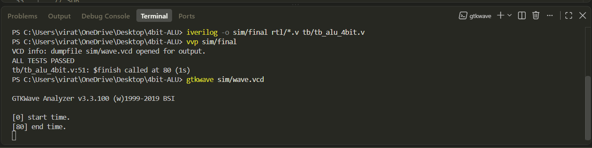
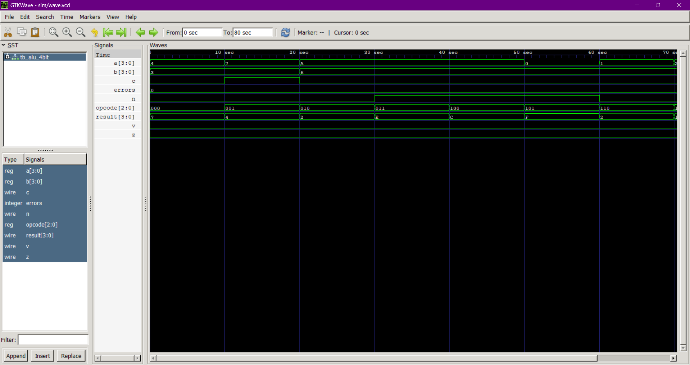

# 4-bit ALU (Verilog)

A simple 4-bit ALU built in Verilog. Does 8 operations, fully modular, tested with a self-checking testbench.

## What it does

8 operations, selected using a 3-bit opcode:

| Opcode | Operation |
|--------|-----------|
| 000    | ADD       |
| 001    | SUB       |
| 010    | AND       |
| 011    | OR        |
| 100    | XOR       |
| 101    | NOT A     |
| 110    | Shift Left  |
| 111    | Shift Right |

Also has 4 flags:
- **Z** – result is zero
- **C** – carry out (only for ADD/SUB)
- **V** – overflow (only for ADD/SUB)
- **N** – result is negative

## How it works

All 8 operations run at the same time in parallel. A MUX picks the right one based on opcode.

ADD and SUB share the same adder — subtraction is done as `A + (~B) + 1` using XOR gates to flip B when needed. Saves building two separate circuits.

## Folder structure
rtl/ → all verilog modules
tb/ → testbench
sim/ → simulation output files
docs/ → screenshots

## How to run

```bash
iverilog -o sim/test rtl/*.v tb/tb_alu_4bit.v
vvp sim/test
gtkwave sim/wave.vcd
```

## Test result

Self-checking testbench, 8 test cases (1 per operation).

**Result: ALL TESTS PASSED**





## Why some design choices were made

- Used a simple Ripple Carry Adder, not CLA — at 4-bit size, the speed difference doesn't matter. CLA is only worth it for bigger adders (16-bit+).
- Shared one adder for ADD and SUB instead of building two — saves hardware since subtraction is just addition with an inverted input.
- C and V flags are forced to 0 for anything that isn't ADD/SUB, since they don't mean anything for AND/OR/etc.

## Author
VIRAT SINGH
